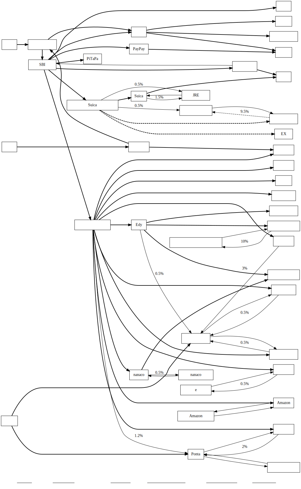

# Money Flow Diagram
収入から支出に至る金銭の流れを図解したグラフ

## 点(node)
上から順に「収入」「銀行口座」「クレジットカード」「ポイント」「金券」「支出」の順に記す

0. **収入**: 収入源ごとにノードを作成
0. **銀行口座**: 銀行ごとまたは口座ごとにノードを作成
0. **クレジットカード**: カードごとにノードを作成
0. **ポイント**: 支払いに対して還元されるもの。ポイントの種類ごとにノードを作成
0. **金券**: 買い切り形式で、特定の用途にしか使えないもの。金券の種類ごとにノードを作成
0. **支出**: 支出先の店名や種類ごとにノードを作成

## 枝(edge)
金銭が出るもとを*始点*、金銭が入る先を*終点*とする矢印で記す

- 基本的な**支出**は*太い線*で記す
- 支出に対する**還元**は*細い線*で記し、ラベルに**還元率**を記す
- **稀な支出**、**削減予定の支出**は*点線*で記す

## 作成例(example)

